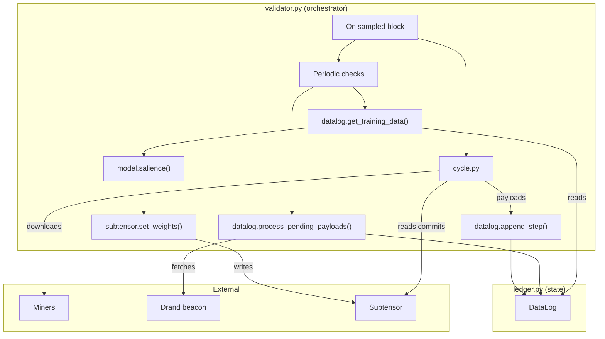

# MANTIS

## Purpose
MANTIS is a Bittensor subnet (netuid 123) that rewards miners for signals which help predict the next-hour return of several financial instruments. Each challenge specifies a ticker, embedding dimension and a fixed 300‑block horizon. Validators collect encrypted embeddings, align them with price moves and assign weights based on salience.

---

## Minimal Architecture Diagram


---

## Core Modules
1. **`config.py`** – Defines network constants and the `CHALLENGES` list.
2. **`ledger.py`** – Contains the `DataLog` and per‑challenge `ChallengeData` structures. It stores prices, decrypted embeddings and raw payloads and handles decryption & validation.
3. **`validator.py`** – Orchestrates block sampling, payload collection, decryption, model training and weight setting.
4. **`model.py`** – Computes per‑hotkey salience using an XGBoost model and permutation importance.
5. **`cycle.py`** – Downloads miner payloads and validates commit URLs.
6. **`comms.py`** – Performs asynchronous HTTP downloads with caching.

---

## Data Structure
```python
@dataclass
class ChallengeData:
    dim: int
    blocks_ahead: int
    sidx: Dict[int, Dict[str, Any]]

class DataLog:
    blocks: List[int]
    challenges: Dict[str, ChallengeData]
    raw_payloads: Dict[int, Dict[str, bytes]]
```
Each challenge maps sample indices to prices and hotkey embeddings. The `DataLog` holds the per‑block payload queue and the challenge data.

---

## End‑to‑End Workflow
1. **Initialise** – `validator.py` loads or creates a `DataLog` and syncs the metagraph.
2. **Collect** – Every `SAMPLE_EVERY` blocks the validator downloads encrypted payloads and current prices and appends them via `datalog.append_step`.
3. **Decrypt** – `datalog.process_pending_payloads` obtains Drand signatures once the 300‑block delay has elapsed, decrypts payloads, validates structure and stores embeddings.
4. **Prune** – Periodically, inactive hotkeys are removed from challenge data via `datalog.prune_hotkeys`.
5. **Evaluate** – Every `TASK_INTERVAL` blocks the validator builds training data, computes salience scores and normalises weights on‑chain.

---

## Security Highlights
- **Time‑lock encryption** prevents miners from seeing future prices before submitting.
- **Embedded hotkey checks** ensure decrypted payloads belong to the committing miner.
- **Payload validation** replaces malformed data with zero vectors.
- **Download size limits** mitigate denial‑of‑service attacks.

---

## Dependencies
The main dependencies are listed in `requirements.txt` and include `bittensor`, `xgboost`, `timelock`, `requests` and `aiohttp`.

---

## Extensibility
- Swap out the salience algorithm by editing **`model.py`**.
- Adjust challenges or hyperparameters in **`config.py`**.
- Modify storage or decryption logic in **`ledger.py`**.

---

## License
Released under the MIT License © 2024 MANTIS.

