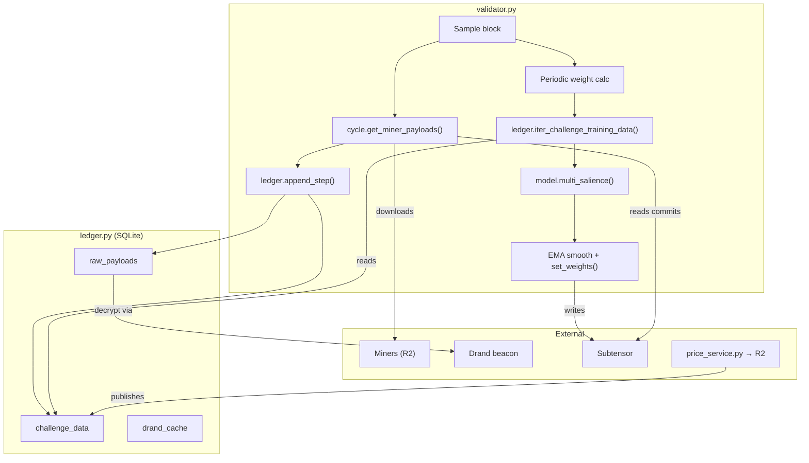

# MANTIS

Bittensor Subnet 123 — Multi-challenge signal aggregation network.

---

## Architecture

Validators sample miner payloads every `SAMPLE_EVERY` blocks, decrypt them after a timelock maturation window, and store (embedding, price) pairs in a SQLite database. Periodically, walk-forward scoring computes per-hotkey salience for each challenge, aggregates across challenges by weight, applies EMA smoothing, and sets on-chain weights.

```mermaid
graph TD
    subgraph validator["validator.py"]
        A["Sample block"] --> B["cycle.get_miner_payloads()"]
        B --> C["ledger.append_step()"]
        A --> D["Periodic weight calc"]
        D --> E["ledger.iter_challenge_training_data()"]
        E --> F["model.multi_salience()"]
        F --> G["EMA smooth + set_weights()"]
    end

    subgraph ledger["ledger.py (SQLite)"]
        H["challenge_data"]
        I["raw_payloads"]
        J["drand_cache"]
    end

    subgraph external["External"]
        K["Miners (R2)"]
        L["Drand beacon"]
        M["Subtensor"]
        N["price_service.py → R2"]
    end

    C --> H
    C --> I
    E -- reads --> H
    B -- downloads --> K
    I -- decrypt via --> L
    G -- writes --> M
    B -- reads commits --> M
    N -- publishes --> H
```

---

## Challenges

All challenges are defined in `config.py` under `CHALLENGES`. Each specifies a `ticker`, `dim`, `blocks_ahead` (forward horizon in blocks at 12s/block), `loss_func` (scoring dispatch key), and `weight` (relative importance in final aggregation).

| Challenge | Ticker | dim | Horizon | loss\_func | Weight | Description |
|---|---|---|---|---|---|---|
| ETH-1H-BINARY | `ETH` | 2 | 300 (1h) | `binary` | 1.0 | Binary direction prediction |
| CADUSD-1H-BINARY | `CADUSD` | 2 | 300 | `binary` | 1.0 | " |
| NZDUSD-1H-BINARY | `NZDUSD` | 2 | 300 | `binary` | 1.0 | " |
| CHFUSD-1H-BINARY | `CHFUSD` | 2 | 300 | `binary` | 1.0 | " |
| XAGUSD-1H-BINARY | `XAGUSD` | 2 | 300 | `binary` | 1.0 | " |
| ETH-HITFIRST | `ETHHITFIRST` | 3 | 500 | `hitfirst` | 2.5 | Barrier-hit direction |
| ETH-LBFGS | `ETHLBFGS` | 17 | 300 (1h) | `lbfgs` | 3.5 | Volatility regime + quantile paths |
| BTC-LBFGS-6H | `BTCLBFGS` | 17 | 1800 (6h) | `lbfgs` | 2.875 | " |
| MULTI-BREAKOUT | `MULTIBREAKOUT` | 2/asset | event | `range_breakout_multi` | 5.0 | Range breakout continuation/reversal (33 assets) |
| XSEC-RANK | `MULTIXSEC` | 1/asset | 1200 (4h) | `xsec_rank` | 3.0 | Cross-sectional return ranking (33 assets) |
| FUNDING-XSEC | `FUNDINGXSEC` | 1/asset | 2400 (8h) | `funding_xsec` | 4.0 | Cross-sectional funding rate ranking (20 assets) |

---

## Scoring

### Walk-forward meta-model

All challenge types follow a two-stage walk-forward evaluation with strict temporal embargo.

**Stage 1 — Feature selection.** For each miner \(j\), fit an L2 logistic regression on the miner's historical predictions against realized labels. Evaluate OOS AUC on a held-out window. Select top-\(K\) miners by AUC (default \(K = 20\)).

**Stage 2 — Meta-model.** Stack the selected miners' OOS base-model predictions as features in an ElasticNet (or L2) logistic regression. Extract miner importance from absolute coefficient magnitude:

\[
w_j = |{\beta_j}| \cdot \max\!\Big(\frac{\text{AUC}_{\text{meta}} - 0.5}{0.5},\; 0\Big)
\]

Segment-level importances are aggregated with exponential recency weighting (half-life configurable via `HALFLIFE`).

### Embargo

For challenges with forward-looking labels, the embargo between train and validation windows is:

\[
\text{embargo} = \max(\text{LAG},\; \text{ahead})
\]

where `ahead = blocks_ahead / SAMPLE_EVERY`. Training rows whose labels reference data within the validation window are excluded via `train_cutoff = val_start - ahead`.

### Sybil resistance

L2 regularization splits coefficient mass among correlated miners. If \(n\) clones submit identical predictions, each receives \(\approx w/n\) weight. L1 drives zero-information miners to exactly zero.

### Cross-sectional challenges (XSEC-RANK, FUNDING-XSEC)

The ranking problem is reformulated as binary classification: for each (timestep, asset) pair, the label is 1 if the asset's forward metric exceeds the cross-sectional median. All assets are pooled into a single problem, multiplying effective sample count by the number of assets. Stale miners (temporal std < \(10^{-4}\)) are zeroed before pooling.

### Weight aggregation

Per-challenge salience vectors are normalized to sum to 1, multiplied by challenge weight, and averaged:

\[
s_j = \frac{1}{\sum_c w_c} \sum_c w_c \cdot \hat{s}_{j,c}
\]

EMA smoothing (\(\alpha = 0.15\)) is applied across weight-setting intervals to reduce block-to-block variance. Degenerate distributions (near-uniform or zero-sum) are rejected.

---

## Encryption

Dual-path encryption ensures no party can observe predictions before maturation:

1. **Owner path** — X25519 ECDH + ChaCha20-Poly1305 AEAD. The owner can decrypt immediately for trading.
2. **Timelock path** — Drand IBE (BLS12-381). After the specified Drand round, validators decrypt via the published beacon signature.

A SHA-256 binding hash over (hotkey, round, owner\_pk, ephemeral\_pk) is used as AAD, preventing replay, relay, and substitution attacks.

---

## Modules

| File | Role |
|---|---|
| `config.py` | Challenge definitions, network constants, encryption params |
| `validator.py` | Block sampling, payload collection, decryption scheduling, weight setting |
| `ledger.py` | SQLite storage, submission validation, training data iteration, Drand cache |
| `model.py` | `multi_salience()` — dispatches to per-challenge scoring, aggregates |
| `cycle.py` | Miner payload download, commit URL validation |
| `funding_xsec.py` | FUNDING-XSEC scoring: forward pairing, label construction, walk-forward |
| `xsec_rank.py` | XSEC-RANK scoring |
| `range_breakout.py` | MULTI-BREAKOUT state machine + scoring |
| `bucket_forecast.py` | LBFGS classifier + Q-path salience |
| `hitfirst.py` | HITFIRST barrier-hit scoring |
| `price_service.py` | Fetches spot prices (Polygon) + funding rates (OKX/HL/CoinGlass), uploads to R2 |

---

## Storage

SQLite with WAL mode. Tables:

- **`challenge_data`** — `(ticker, sidx)` → `price` or `price_data` (JSON for multi-asset), `hotkeys` (JSON list), `embeddings` (binary float16 blob)
- **`challenge_meta`** — `(ticker)` → `dim`, `blocks_ahead`
- **`block_index`** — Sequential index → block number mapping
- **`raw_payloads`** — Encrypted ciphertexts held until maturation
- **`drand_cache`** — Cached beacon signatures
- **`breakout_state`** — Serialized range tracker state

Training data is streamed via generator iteration, not loaded into memory.

---

## Key Parameters

| Parameter | Value | Location |
|---|---|---|
| `SAMPLE_EVERY` | 5 blocks (60s) | `config.py` |
| `LAG` | 60 samples | `config.py` |
| `TASK_INTERVAL` | 500 blocks | `config.py` |
| `WEIGHT_CALC_INTERVAL` | 1000 blocks | `config.py` |
| `WEIGHT_SET_INTERVAL` | 360 blocks | `config.py` |
| `BURN_PCT` | 0.30 (UID 0) | `config.py` |
| `MAX_DAYS` | 60 | `config.py` |
| `EMA alpha` | 0.15 | `validator.py` |
| `TOP_K` (feature selection) | 20 | `funding_xsec.py`, `xsec_rank.py` |

---

## Payload Format

V2 JSON only. Required fields: `v`, `round`, `hk`, `owner_pk`, `C`, `W_owner`, `W_time`, `binding`, `alg`.

Commit constraints:
- Host: Cloudflare R2 (`*.r2.dev` or `*.r2.cloudflarestorage.com`)
- Object key: exactly your hotkey (no path segments)
- Size: ≤ 25 MB

---

## Dependencies

Declared in `pyproject.toml`. Core: `bittensor`, `torch`, `scikit-learn`, `numpy`, `requests`, `aiohttp`, `tqdm`, `boto3`.

See `MINER_GUIDE.md` for submission details per challenge type.

---

## License

MIT License (c) 2024 MANTIS
