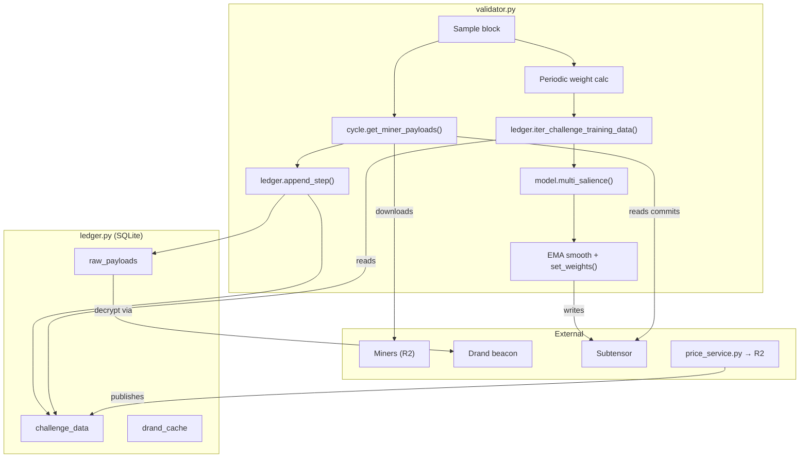

# MANTIS

Bittensor Subnet 123, The Ultimate Signal Machine

---

## Architecture

Validators sample miner payloads every `SAMPLE_EVERY` blocks, decrypt them after a timelock maturation window, and store (embedding, price) pairs in a SQLite database. Periodically, walk-forward scoring computes per-hotkey salience for each challenge, aggregates across challenges by weight, applies EMA smoothing, and sets on-chain weights.

```mermaid
graph TD
    subgraph validator["validator.py"]
        A["Sample block"] --> B["cycle.get_miner_payloads()"]
        B --> C["ledger.append_step()"]
        A --> D["Periodic weight calc"]
        D --> E["ledger.iter_challenge_training_data()"]
        E --> F["model.multi_salience()"]
        F --> G["EMA smooth + set_weights()"]
    end

    subgraph ledger["ledger.py (SQLite)"]
        H["challenge_data"]
        I["raw_payloads"]
        J["drand_cache"]
    end

    subgraph external["External"]
        K["Miners (R2)"]
        L["Drand beacon"]
        M["Subtensor"]
        N["price_service.py → R2"]
    end

    C --> H
    C --> I
    E -- reads --> H
    B -- downloads --> K
    I -- decrypt via --> L
    G -- writes --> M
    B -- reads commits --> M
    N -- publishes --> H
```

---

## Challenges

All challenges are defined in `config.py` under `CHALLENGES`. Each specifies a `ticker`, `dim`, `blocks_ahead` (forward horizon in blocks at 12s/block), `loss_func` (scoring dispatch key), and `weight` (relative importance in final aggregation).

| Challenge | Ticker | dim | Horizon | loss_func | Weight | Description |
|---|---|---|---|---|---|---|
| ETH-1H-BINARY | `ETH` | 2 | 300 (1h) | `binary` | 1.0 | Binary direction prediction |
| CADUSD-1H-BINARY | `CADUSD` | 2 | 300 | `binary` | 0.5 | " |
| NZDUSD-1H-BINARY | `NZDUSD` | 2 | 300 | `binary` | 0.5 | " |
| CHFUSD-1H-BINARY | `CHFUSD` | 2 | 300 | `binary` | 1.0 | " |
| XAGUSD-1H-BINARY | `XAGUSD` | 2 | 300 | `binary` | 1.0 | " |
| ETH-HITFIRST | `ETHHITFIRST` | 3 | 500 | `hitfirst` | 1.25 | Barrier-hit direction |
| ETH-LBFGS | `ETHLBFGS` | 17 | 300 (1h) | `lbfgs` | 3.5 | Volatility regime + quantile paths |
| BTC-LBFGS-6H | `BTCLBFGS` | 17 | 1800 (6h) | `lbfgs` | 2.875 | " |
| MULTI-BREAKOUT | `MULTIBREAKOUT` | 2/asset | event | `range_breakout_multi` | 5.0 | Range breakout continuation/reversal (33 assets) |
| XSEC-RANK | `MULTIXSEC` | 1/asset | 1200 (4h) | `xsec_rank` | 3.0 | Cross-sectional return ranking (33 assets) |
| FUNDING-XSEC | `FUNDINGXSEC` | 1/asset | 2400 (8h) | `funding_xsec` | 4.0 | Cross-sectional funding rate ranking (20 assets) |
| FLOW-BTC | `FLOW` | 28 | horizon-driven, 1–336h | `flow` | 0.0 (7.875 = 25% at emission turn-on, 2026-09-14) | Capital-at-risk BTC bracket trades, evidence-gated payment |

TRADE-MIX is deprecated as of the FLOW launch (2026-08-17): off the
active roster, historical challenge data purged from validator
datalogs on open.

---

## Scoring

### Per-challenge scoring

Each `loss_func` has its own scoring path. All use L2 logistic regression and coefficient-based importance, but the structure differs.

**Binary** (`binary`) — Walk-forward with ElasticNet meta-model. Feature selection: per-miner L2 logistic on first half, AUC on second half, select top-$K$ (default 50). Meta-model: ElasticNet logistic (L1 ratio 0.5) on OOS base-model predictions across walk-forward segments. Importance = $|\beta_j|$. Segments weighted by recency.

**LBFGS** (`lbfgs`) — Two independent scoring paths blended 75/25:
- *Classifier path* (`compute_linear_salience`): per-class L2 logistic regressions on 5-bucket argmax predictions. Importance = $\beta_j^2$ summed across classes. Vectorized balanced accuracy evaluation. Uniqueness penalty suppresses miners with >85% argmax overlap with higher-ranked peers.
- *Q-path* (`compute_q_path_salience`): 12 independent binary L2 logistic models (one per tail-bucket / sigma-threshold combination). Importance = averaged $|\beta_j|$ across sub-models.

Both paths are individually top-$K$ renormalized with exponential rank decay before blending.

**HITFIRST** (`hitfirst`) — Two L2 logistic regressions on logit-transformed miner probabilities: one for up-barrier-hit ($y=1$ if price hits $+\sigma$ first), one for down-barrier-hit. Importance = $|\beta_j^{\text{up}}| + |\beta_j^{\text{down}}|$. No walk-forward — single fit on all valid samples.

**MULTI-BREAKOUT** (`range_breakout_multi`) — Operates on completed breakout events (not time series). Two-stage: (1) Empirical AUC gate — per-miner AUC on $P_{\text{continuation}}$ vs realized label, requiring AUC > 0.5 and ≥ 2 temporal episodes. (2) L2 logistic on z-scored miner predictions with episode-balanced sample weighting (each temporal episode gets equal total weight regardless of event count). Importance = $|\beta_j|$.

**XSEC-RANK** (`xsec_rank`) — Cross-sectional binary reformulation: label = 1 if asset's forward return exceeds the cross-sectional median. All assets pooled ($N_{\text{assets}} \times$ sample multiplier). Walk-forward meta-model: feature selection by per-miner univariate AUC, top-$K$ (default 20) selected, L2 logistic meta-model. Importance per segment:

$$
w_j = |\beta_j| \cdot \max\!\Big(\frac{\text{AUC}_{\text{meta}} - 0.5}{0.5},\; 0\Big)
$$

Segments aggregated with exponential recency weighting.

**FUNDING-XSEC** (`funding_xsec`) — Same structure as XSEC-RANK but on funding rate changes instead of price returns. Embargo = $\max(\text{LAG}, \text{ahead})$ with explicit `train_cutoff = val_start - ahead` to prevent label leakage from forward-looking labels. Stale miners (temporal std < $10^{-4}$ per asset column) zeroed before pooling.

**FLOW** (`flow`) — Not a regression challenge: miners submit bracket trades (direction, Kelly fraction, stop, two targets, horizon) across four horizon regimes, resolved against multi-venue klines. Per-trade R is path-penalized, tail-amplified, and Kelly-weighted into a per-regime EWMA, and payment is gated behind a significance statistic, the max of the full-history and rolling last-4-block $t$ on 168h block sums (clear $t \geq 1.25$, latch at $0.5$): cleared keys split the pool pro rata, uncleared keys split a 2% dust tier, the remainder burns. Once the collateral pool is configured, emission weight and settlement money are both priced by the posted bet, with a weekly zero-sum settlement. Full spec, math, and simulation evidence: the FLOW release paper (`FLOW_RELEASE.pdf`, published on the MANTIS site).

### Sybil resistance

L2 regularization splits coefficient mass among correlated miners. If $n$ clones submit identical predictions, each receives $\approx w/n$ weight. L1 (in binary challenges) or the uniqueness penalty (in LBFGS) drives zero-information or duplicate miners to zero.

### Weight aggregation

Per-challenge salience vectors are normalized to sum to 1, multiplied by challenge weight, and averaged:

$$
s_j = \frac{1}{\sum_c w_c} \sum_c w_c \cdot \hat{s}_{j,c}
$$

EMA smoothing ($\alpha = 0.15$) is applied across weight-setting intervals to reduce block-to-block variance. Degenerate distributions (near-uniform or zero-sum) are rejected.

---

## Encryption

Dual-path encryption ensures no party can observe predictions before maturation:

1. **Owner path** — X25519 ECDH + ChaCha20-Poly1305 AEAD. The owner can decrypt immediately for trading.
2. **Timelock path** — Drand IBE (BLS12-381). After the specified Drand round, validators decrypt via the published beacon signature.

A SHA-256 binding hash over (hotkey, round, owner_pk, ephemeral_pk) is used as AAD, preventing replay, relay, and substitution attacks.

---

## Modules

| File | Role |
|---|---|
| `config.py` | Challenge definitions, network constants, encryption params |
| `validator.py` | Block sampling, payload collection, decryption scheduling, weight setting |
| `ledger.py` | SQLite storage, submission validation, training data iteration, Drand cache |
| `model.py` | `multi_salience()` — dispatches to per-challenge scoring, aggregates |
| `cycle.py` | Miner payload download, commit URL validation |
| `funding_xsec.py` | FUNDING-XSEC scoring: forward pairing, label construction, walk-forward |
| `xsec_rank.py` | XSEC-RANK scoring |
| `range_breakout.py` | MULTI-BREAKOUT state machine + scoring |
| `bucket_forecast.py` | LBFGS classifier + Q-path salience |
| `hitfirst.py` | HITFIRST barrier-hit scoring |
| `flow.py` | FLOW bracket-trade resolution, scoring, significance gate, payment split |
| `flow_collateral.py` | Client for the FLOW collateral pool: hotkey-signed position open (`addCollateralSigned`, so a slot cannot be squatted), `evict`, bet posting, the `TradePosted` bet feed that prices all money and emission skin |
| `flow_post.py` | Miner-side CLI: `fund` / `evict` / `book` / `post` / `status` / `audit` — open the slot with your hotkey, post bets for a payload vector, prove from event logs that no debit ever exceeded a bet |
| `flow_sim/` | FLOW simulation evidence: mechanism replica, adversary studies, release figures |
| `../flow_collateral/src/FlowCollateralPool.sol` | The on-chain pool (one contract, this copy only). Live at `0xD9c805202b16671A2901307fBC9A8750E2453427` |
A public read-only settlement console (books, withdrawability, pools,
settlement history — straight `eth_call`/`eth_getLogs`, no keys) is
served on the MANTIS site; it is deployed from the site's own project
rather than shipped here. There is deliberately no bundled submission
UI: `generate_and_encrypt.py` and `flow_post.py` are the supported
surface, and anything interactive you build on top runs your code
with your credentials, not ours.

The FLOW **settlement daemon is not in this repo**: it is owner
tooling, kept and run separately by the team (it holds the owner keys,
which must never sit in a public tree). What it does is fully
specified below and in the release paper (§3.3), and every number it
posts is recomputable from public data one week later.

---

## The owner settlement process (run separately, not in this repo)

**THE MODEL: miners post their own bets, by hand, on chain — the
owner can only resolve them.** The team runs a settlement daemon on
two boxes (primary + staleness-gated standby). Each cycle it:

1. **Ingests** every `TradePosted` / `TradeClosed` / `TradeExpired`
   event from the live FlowCollateralPool at
   `0xD9c805202b16671A2901307fBC9A8750E2453427` — that sync is how
   bets enter it; it never opens, resizes, or extends anything.
2. **Decrypts payloads at arrival** through the envelope's owner leg
   (`W_owner`), so trade resolutions exist the moment they happen.
   The public timelock (`W_time`) opens the same plaintexts to
   everyone one week later — validators and miners never need the
   owner key, and this validator codebase only ever decrypts the
   public way.
3. **Closes** each resolved bet: `closeBatch` debits
   `max(−R, 0) × bet` (wins and flats close at 0 and free the
   reserve). The contract bounds every debit by the bet the miner
   posted and by the period circuit breaker (≤ ¼ of a book per real
   week). A bet posted after its trade opened is voided both ways
   (free-look guard, 900 s grace).
4. **Settles** each week after a 24 h straggler lag: refunds
   gross-over-net collections, then pays the pool to net winners pro
   rata — zero-sum, enforced on chain, period ids strictly in order.

**What miners should expect, and when:**

| When | What you see |
| --- | --- |
| you post the bet (before the trade opens) | reserve held on chain, immutable; free collateral = balance − reserves stays withdrawable instantly |
| trade resolves (SL / TP / horizon) | a `TradeClosed` event within minutes–hours; losses debit ≤ your bet, wins/flats release the reserve at loss 0 |
| week end + 24 h | `Settled`: the week's loss pool pays net winners pro rata; refunds land in the same batch |
| one week after each payload | the timelock opens: anyone can recompute every close and settle from the public panel, the tape, and the bets |
| regime ceiling + 48 h with no close | owner outage path: the reserve self-releases; `sweepExpired` is permissionless, so no owner failure can lock your collateral |

The owner cannot touch anything you did not put at risk: no bet means
no debit and no claim, ever; free collateral is unreachable; there is no
slash. Opening a position is hotkey-authorized (`addCollateralSigned`):
nobody can squat a registered hotkey's slot by funding it first, and
a hotkey-signed `evict` can only pay a flat book back to its recorded
refund coldkey. Emission weighting uses the same basis — each trade's
pay is priced by its posted bet (read from public `TradePosted` logs),
so idle balance earns nothing and post-open deposits or withdrawals
move nothing.

---

## Storage

SQLite with WAL mode. Tables:

- **`challenge_data`** — `(ticker, sidx)` → `price` or `price_data` (JSON for multi-asset), `hotkeys` (JSON list), `embeddings` (binary float16 blob)
- **`challenge_meta`** — `(ticker)` → `dim`, `blocks_ahead`
- **`block_index`** — Sequential index → block number mapping
- **`raw_payloads`** — Encrypted ciphertexts held until maturation
- **`drand_cache`** — Cached beacon signatures
- **`breakout_state`** — Serialized range tracker state

FLOW rows live in a separate file, `flow_datalog.db`, attached to
every connection as schema `inv` (its only table is `challenge_data`).
It is published to the same bucket as its own, much smaller object
(`FLOW_DATALOG_ARCHIVE_URL`); the legacy `datalog.db` keeps the old
tickers. Shared state (blocks, raw payloads, drand cache) stays in the
main DB because one raw payload covers every challenge.

Publishing FLOW: upload the file produced by
`DataLog.snapshot_for_publish(dest_dir)`, never the live DB file. A
live WAL database (file + `-wal` + `-shm`) copied mid-write is a torn
read; the snapshot method uses `VACUUM INTO` for a consistent,
standalone copy. The main `datalog.db` keeps its existing save and
publish flow unchanged.

Training data is streamed via generator iteration, not loaded into memory.

---

## Key Parameters

| Parameter | Value | Location |
|---|---|---|
| `SAMPLE_EVERY` | 5 blocks (60s) | `config.py` |
| `LAG` | 60 samples | `config.py` |
| `TASK_INTERVAL` | 500 blocks | `config.py` |
| `WEIGHT_CALC_INTERVAL` | 1000 blocks | `config.py` |
| `WEIGHT_SET_INTERVAL` | 360 blocks | `config.py` |
| `BURN_PCT` | 0.35 (UID 0) | `config.py` |
| `MAX_DAYS` | 60 | `config.py` |
| `EMA alpha` | 0.15 | `validator.py` |
| `TOP_K` (feature selection) | 20 | `funding_xsec.py`, `xsec_rank.py` |
| `FLOW_COLLATERAL_ADDRESS` | `0xD9c805202b16671A2901307fBC9A8750E2453427` | `config.py` (Bittensor EVM, chain 964) |
| `FLOW_COLLATERAL_PERIOD_ZERO` | 1787004000 (2026-08-17 22:00 UTC) | `config.py` / on-chain immutable |

---

## Payload Format

V2 JSON only. Required fields: `v`, `round`, `hk`, `owner_pk`, `C`, `W_owner`, `W_time`, `binding`, `alg`.

Commit constraints:
- Host: Cloudflare R2 (`*.r2.dev` or `*.r2.cloudflarestorage.com`)
- Object key: exactly your hotkey (no path segments)
- Size: ≤ 25 MB

---

## Dependencies

Declared in `pyproject.toml`. Core: `bittensor`, `torch`, `scikit-learn`, `numpy`, `requests`, `aiohttp`, `tqdm`, `boto3`.

See `MINER_GUIDE.md` for submission details per challenge type.

---

## Updating

Releases are distributed as a zip archive, not via git. To update:
stop the validator (`pm2 stop validator`), unpack the new archive
over the old directory (your `.env`, datalog files, and logs are
untouched — the archive contains only code and docs), re-run
`./install_reqs.sh` if the release notes say requirements changed,
and restart (`pm2 restart validator`). Do not rely on git-based
auto-updating against the GitHub remote.

---

## Model Iteration Tool

The [MANTIS Model Iteration Tool](https://github.com/BarbarianDev/mantis_model_iteration_tool) is a standalone framework for developing, backtesting, and iterating on MANTIS mining strategies. It provides autonomous agent-driven research, walk-forward evaluation with causal data access, and a web dashboard for tracking iterations across all challenge types. See the [repository](https://github.com/BarbarianDev/mantis_model_iteration_tool) for setup and SDK documentation.

---

## License

MIT License (c) 2024 MANTIS
